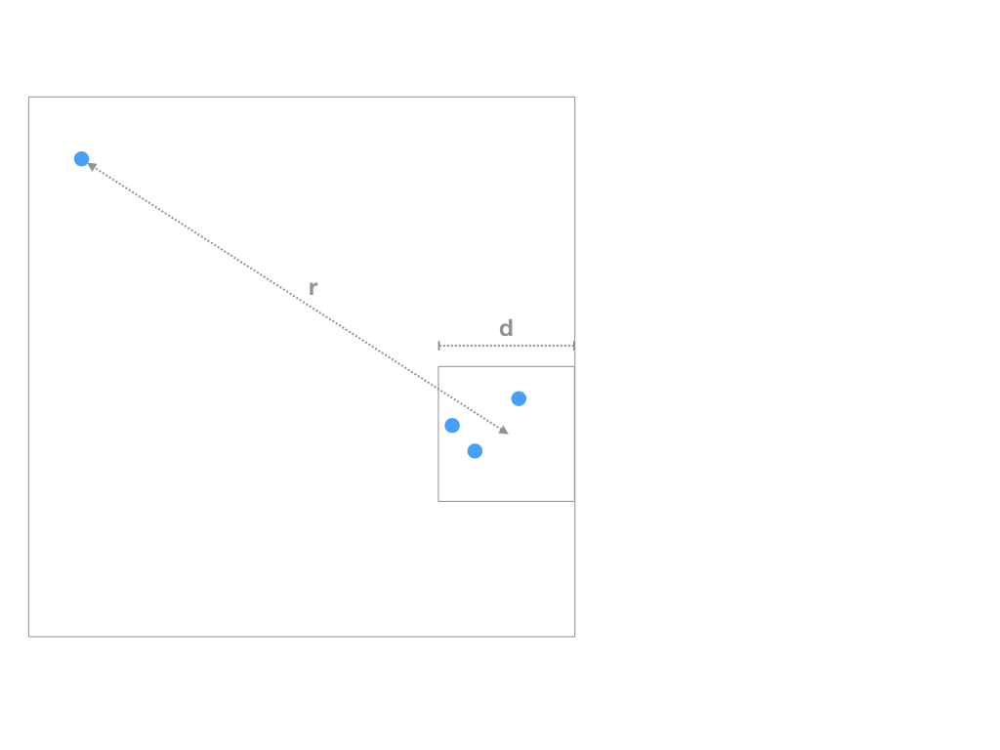
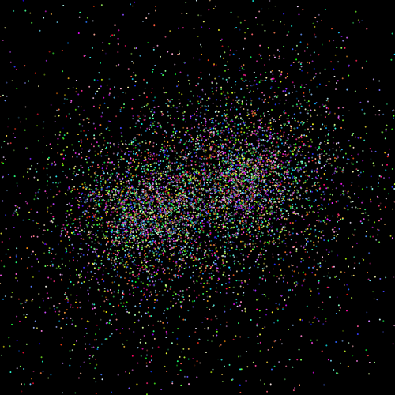
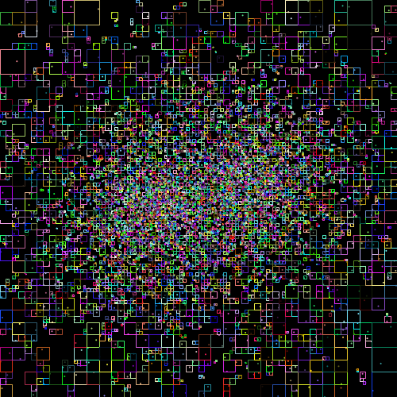

# Teamaufgabe

## Allgemeine Anmerkungen

Dieses Aufgabenblatt soll in Gruppen bestehend aus 2 Personen bearbeitet werden. Bitte melden 
Sie sich in TUWEL unter `Teamaufgabe Kleingruppen` an. Auf Grund der 
aktuellen Situation (Coronavirus) sollen keine physischen Treffen stattfinden. Nutzen Sie 
entsprechende Kanäle um im Team zu arbeiten. Für jede Gruppe wird es ein eigenes Repository 
geben. 

## Thema

In den bisherigen Simulationen traten nur relativ wenige Himmelskörper auf. Die algorithmischen 
Kosten zur Berechnung der nächsten Position war bisher quadratisch in N, das heißt, O(N²), wobei N 
die Anzahl der Himmelskörper in der mi17bta10.simulation.Simulation ist. Das liegt daran, dass alle N(N-1)/2 Paare 
von Himmelskörpern gebildet werden müssen, um deren wechselseitige Gravitation und folglich die neue 
Position aller Himmelskörper berechnen zu können: 

```
    // for each body (with index i): 
    // compute the total force exerted on it.
    for (int i = 0; i < bodies.length; i++) {
        forceOnBody[i] = new mi17bta10.simulation.Vector3(0,0,0);
        for (int j = 0; j < bodies.length; j++) {
            if (i != j) {
                mi17bta10.simulation.Vector3 forceToAdd = 
                    bodies[i].gravitationalForce(bodies[j]);
                forceOnBody[i] = forceOnBody[i].plus(forceToAdd);
            }
        }
    }
    // now forceOnBody[i] holds the force vector 
    // exerted on body with index i.
```
*Codebeispiel 1: verschachtelte Schleifen in der Methode `main` der Klasse `mi17bta10.simulation.Simulation` in 
Aufgabenblatt2.*

Ziel dieser Teamaufgabe ist es, die algorithmischen Kosten durch Verwendung eines 
Näherungsverfahrens zu reduzieren: Grundlage ist der Barnes-Hut-Algorithmus [1] mit dem 
alle wechselseitigen Gravitationskräfte mit einem geringeren Aufwand von O(N*log(N)) angenähert werden können.

Bei einer richtigen Umsetzung können Sie in Ihrer mi17bta10.simulation.Simulation in der Folge eine sehr große Anzahl 
von Himmelskörpern verwenden (Sternhaufen, Galaxien).

## Der Barnes-Hut-Algorithmus

Der Trick des Barnes-Hut-Algorithmus ist, Gruppen von Himmelskörpern, die relativ nahe beisammen 
liegen, zusammenzufassen. Beinhaltet eine solche Gruppe M Himmelskörper und ist die Gesamtmasse 
der Gruppe (Summe aller Massen) und der Schwerpunkt der Gruppe (durch Massen gewichteter Mittelwert 
aller Positionen) bereits berechnet worden, lässt sich die Wirkung der Gruppe auf einen entfernten 
Himmelskörper (der nicht Teil der Gruppe ist) in einem Schritt, anstatt in M Schritten berechnen.

Diese Beschleunigung hat jedoch einen Preis: die Berechnung stimmt nur näherungsweise.
Liegt der Himmelskörper (z.B. unsere Sonne) jedoch weit genug von einer Gruppe (z.B. 
Andromedagalaxie) entfernt, ist der Fehler der Annäherung zu vernachlässigen. Die 
Entfernung r zur Gruppe muss zum Durchmesser d der Gruppe in einem bistimmten Verhältnis stehen. 
Dieses wird mit einem spezifizierten Schwellwert T festgelegt. Um die Gruppe zusammenzufassen, muss 
gelten r/d > T (siehe Abbildung 2).

## Datenstruktur: Octtree

Wie werden nun die Gruppen gefunden, die man zusammenfassen kann? Eine geeignete Datenstruktur
ist der Quadtree in 2D bzw. der Octtree in 3D. Wir werden die Konzepte anhand des Quadtrees 
darstellen, in Ihrer Lösung sollen Sie dann aber einen Octtree verwenden, da die Himmelskörper im
3D-Raum liegen:

1. Der erste Schritt ist, alle Himmelskörper der mi17bta10.simulation.Simulation in eine Baumstruktur (den Quadtree 
bzw. Octtree) einzufügen. Das Einfügen geschieht rekursiv: Ist ein Knoten leer (N), wird der 
Himmelskörper eingefügt und es ensteht dabei ein Blattknoten, der genau einen Himmelskörper 
enthält. Ist der Knoten, in den eingefügt wird, ein Blattknoten mit genau einem Himmelskörper, wird 
der Blattknoten in vier - zunächst leere - Quadranten geteilt und beide Himmelskörper 
in die entsprechenden Quadranten eingefügt. Jeder Quadrant entspricht einem Unterbaum (siehe Abbildung 1). 
Zur Vermeidung mehrfacher Berechnungen sollte jeder Knoten (auf jeder Ebene des Baumes) Gesamtmasse 
und Schwerpunkt der enthaltenen Himmelskörper in einer Variable speichern. Die Größen werden beim 
Einfügen aktualisiert. Recherchieren Sie ggfs. die Details einer Quadtree-Implementierung.

2. Berechnung der Schwerkraft: Für jeden Himmelskörper (hier kann ein Iterator über alle Elemente 
des Baums genutzt werden) wird die auf ihn wirkende Kraft berechnet. Dabei wird die Baumstruktur
ausgenutzt. Für Teilbäume, deren Quadranten die in Abbildung 2 beschriebenen Eigenschaften erfüllen,
das heißt, vom Himmelskörper weit genug entfernt sind, kann die Kraft, die vom Quadranten ausgeht, 
ermittelt werden, ohne den Baum weiter hinab steigen zu müssen. Es wird also von 
den Nachbarknoten eines Himmelskörpers ausgehend getestet, ob ein Quadrant die Eigenschaft 
erfüllt. Ist das nicht der Fall, werden - solange es noch welche gibt - alle Unterquadranten 
geprüft, im ungünstigsten Fall bis zu den Blattknoten. Das bedeutet, dass man für T = 0 die 
gleiche Lösung bekommt, wie bei der direkten Aufsummierung der Kräfte (aufgrund der Verwaltung 
der Daten durch den Baum, jedoch noch langsamer).

3. Nachdem alle Himmelskörper gemäß der auf sie wirkenden Kräfte bewegt wurden, muss der gesamte 
Baum neu aufgebaut werden, das heißt, Punkte 1 und 2 werden in der mi17bta10.simulation.Simulation in einer Schleife 
wiederholt. 


*Abbildung 1: Sieben Himmelskörper und der entsprechende Quadtree: Blattknoten sind entweder NIL
 (leer, `null`) oder beinhalten genau einen Himmelskörper. Knoten, die nicht Blattknoten sind, 
 haben vier Nachfolgerknoten, die vier (Unter-)quadranten repräsentieren. Im Fall eines Octtrees in 
 3D sind es acht Oktanten (Würfelregionen).*
 
 
 *Abbildung 2: Wenn ein einzelner Himmelskörper von einer Gruppe von Himmelskörpern weit genug 
 entfernt ist, kann die Kraft, die von der Gruppe auf den einzelnen Himmelskörper wirkt, schneller 
 berechnet werden. Gruppen entsprechen Teilbäumen, das heißt, (Unter-) Quadranten mit Seitenlänge
 d. Die Genauigkeit der Näherung ist ausreichend, falls r/d > T, wobei r die Distanz vom 
 Himmelskörper zum Mittelpunkt des Quadranten und T ein spezifizierter Schwellwert ist, mit dem 
 die Genauigkeit der mi17bta10.simulation.Simulation eingestellt werden kann. In der Literatur wird häufig T = 1 
 gesetzt.*

## Aufgabe

Entwerfen und implementieren Sie neue Klassen, die die verlangte Datenstruktur abbilden. Nutzen 
Sie dafür die geeigneten Sprachmittel aus der Vorlesung. Erstellen Sie neue Versionen ihrer 
bestehenden Klassen, sodass der oben beschriebene Algorithmus integriert werden kann. Die meisten 
der zur Lösung benötigten Konzepte werden erst in kommenden Vorlesungseinheiten besprochen.
Inbesondere das Kapitel 3 des Skriptums ist für die Erstellung der Lösung hilfreich.

Sie können die Form der graphischen Darstellung selbst auswählen. Der dargestellte Auschnitt 
sollte die gesamte Region, die vom Octtree abgedeckt wird, darstellen. Sie können eine 
Projektionsrichtung für die Visualisierung wählen (z.B. wie bisher Projektionen auf die 
x-y-Ebene). Testen Sie die mi17bta10.simulation.Simulation zunächst mit den Himmelskörpern, die Sie in bisherigen Versionen 
benutzt haben, um vergleichen zu können. Eine weitere Möglichkeit zu testen ist, zunächst alle 
z-Koordinaten 0 zu setzen und auch die Regionen der Blattknoten zu visualisieren (siehe Abbildung 4). 

Generieren Sie unter Verwendung von Zufallszahlgeneratoren eine große Anzahl N von Himmelskörpern 
unterschiedlicher Massen und initialen Positionen und Bewegungsvektoren um Ihre mi17bta10.simulation.Simulation weiter
zu testen. Hier müssen Sie durch Ausprobieren eine brauchbare Initialisierung der mi17bta10.simulation.Simulation finden.
Sie können auch mehrere Sternhaufen an verschiedenen Positionen erzeugen. N sollte spezifizierbar 
sein, oder zu Beginn eingegeben werden. Sie sollten N mindestens 10000 setzen. Ihre mi17bta10.simulation.Simulation 
sollte so effizient sein, dass dabei deutliche Bewegungsmuster erkennbar sind. Wie verhält sich 
die mi17bta10.simulation.Simulation bei verschiedenen Werten von T? Ein Beispiel einer mi17bta10.simulation.Simulation ist in Abbildung 3 
dargestellt.

Sie werden ein Phänomen beobachten, das auch in der Realität auftritt: Manchmal werden Sterne 
aus einem Sternhaufen herausgeschleudert. Auch in der mi17bta10.simulation.Simulation werden hin und wieder Himmelskörper
so stark beschleunigt, dass sie den beobachteten Ausschnitt, also die mit dem Wurzelknoten 
assoziierte Region, verlassen. Diese Himmelskörper können in der nächsten Iteration nicht mehr in 
den Baum übernommen werden. Dadurch verkleinert sich die Anzahl der Himmelskörper in der mi17bta10.simulation.Simulation 
im Lauf der Zeit.

|||
|------------------------------------|------------------------------------|
|                    |                    |
|*Abbildung 3: Eine mi17bta10.simulation.Simulation mit 10000 Himmelskörpern.*|*Abbildung 4: Die mi17bta10.simulation.Simulation mit Darstellung der Quadranten von nicht-leeren Blattknoten.*|


 [1] J. Barnes und P. Hut: ''A hierarchical O(N log N) force-calculation algorithm'' in Nature,324
 (4) Dezember 1986 (kann im TU VPN heruntergeladen werden).